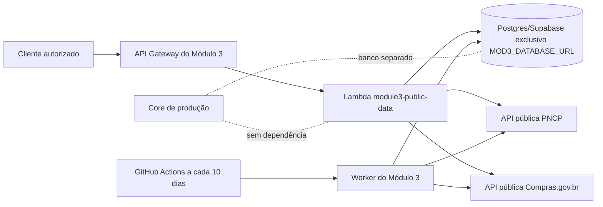

# Módulo 3: arquitetura isolada

O Módulo 3 é um deploy independente. O core não importa seus módulos, não compartilha pool de conexões e não usa as tabelas `mod3_*`. Em AWS, a API pode ser publicada como API Gateway + Lambda próprios; em homologação, o mesmo processo pode rodar como serviço separado.

O workflow possui `contents: read`, usa somente o segredo `MOD3_DATABASE_URL` e não executa migrations ou scripts do core. Em produção, a URL de API e o banco devem ter observabilidade e limites próprios; credenciais devem ficar em Secrets Manager ou nos secrets do ambiente, nunca no repositório.